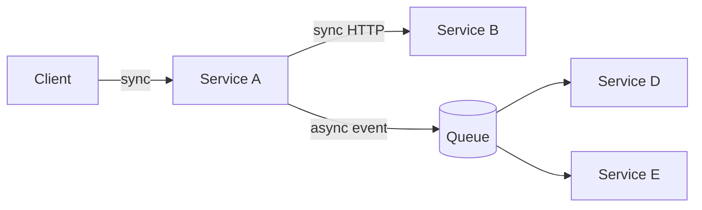

# Microservices

Microservices are an organizational and operational pattern — not just a technical one. Adopt them for the right reasons, with eyes open about the cost.

## When microservices make sense

| Adopt when | Don't adopt when |
|---|---|
| Multiple independent teams need deploy autonomy | One team, one product |
| Components have wildly different scaling needs | Uniform load profile |
| Different parts need different stacks for real reasons | "I want to learn Go" |
| Codebase is genuinely too big for a single team to reason about | Codebase is moderate, just poorly structured |

:::warning The monolith first principle
Start with a well-modularized monolith. Extract services when the seams have proven themselves through actual pain — never preemptively.
:::

## The cost you're signing up for

Every service boundary brings:

- A network call (latency + failure mode)
- A versioned contract to maintain
- Independent deploy + observability stack
- Distributed tracing complexity
- Data consistency across services
- On-call rotation per service

If the benefit isn't worth all of that, don't split.

## Communication patterns

### Synchronous (HTTP / gRPC)

Use when:
- The caller needs the result to continue
- Failure should propagate immediately

Don't:
- Chain more than 2–3 sync hops (latency compounds, failures cascade)
- Use sync for fire-and-forget work

### Asynchronous (queue / event bus)

Use when:
- The caller doesn't need a response
- The work can be retried safely
- You want producers and consumers to scale independently

This is the pattern that makes microservices actually work at scale.

## Data ownership

The hard rule: **each service owns its data**. Other services don't read its DB directly — they call its API.

| ✅ | ❌ |
|---|---|
| Service B calls Service A's `/orders/123` | Service B queries Service A's `orders` table directly |
| Service A publishes `order.created` event; B reads it | B reads A's DB and reverse-engineers schema |

Violate this and you've built a distributed monolith — all the cost of microservices, none of the autonomy.

## Resilience patterns

| Pattern | What it does |
|---|---|
| **Timeout** | Caller waits at most N ms; never hang forever |
| **Retry with backoff + jitter** | Recover from transient failures without thundering herd |
| **Circuit breaker** | Stop calling a broken service; let it recover |
| **Bulkhead** | Isolate critical traffic from non-critical (separate thread pools) |
| **Idempotency keys** | Safe retries of mutations |

Implement these as **standard library code in every service**, not as bespoke logic per caller.

## The "is this really one service?" test

If two "services" are:

- Always deployed together
- Owned by the same team
- Sharing a database
- Tightly coupled at the contract level

…then they're one service in two repos. Merge them.

## Migration: monolith → services

If you have to split:

1. **Identify the seam** with the highest pain (different scaling, different team, different release cadence)
2. **Extract the contract** as a library inside the monolith first
3. **Move the data** — new service gets its own DB
4. **Switch reads** over (dual-write or event-sourced backfill)
5. **Switch writes** over
6. **Delete the monolith's copy** only after burn-in

Never extract everything at once. Strangler-fig pattern: piece by piece.
