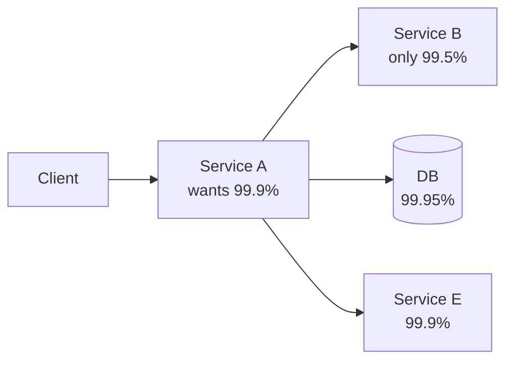

# SLIs, SLOs & SLAs

Reliability isn't a feeling. It's a number — and you have to pick which number, who promises it to whom, and what happens when it breaks.

## The three letters that get confused

| Term | Audience | One-line | Example |
|---|---|---|---|
| **SLI** (Indicator) | Engineering | The metric you measure | "p95 latency on `POST /payments`" |
| **SLO** (Objective) | Internal team | Your target for that metric | "p95 < 500ms, 99.9% of requests succeed" |
| **SLA** (Agreement) | Customer / contract | The external promise with penalties | "99.9% uptime or you get a 10% credit" |

Rule of thumb: **SLA < SLO < actual performance**. If you measure 99.95%, target an SLO of 99.9%, and only promise an SLA of 99.5% — that buffer is what saves your refund budget when something goes wrong.


## Picking SLIs that actually matter

A good SLI is:

1. **User-visible** — measure what the user feels, not what's easy to instrument
2. **A ratio** — `good events / total events` is easier to reason about than absolute numbers
3. **Symmetric** — when it dips, you know the user is suffering

Common SLI patterns:

| Category | Good SLI |
|---|---|
| **Availability** | `(2xx + 3xx + expected 4xx) / total requests` |
| **Latency** | `requests served in < X ms / total requests` |
| **Throughput** | `events processed within Y seconds / total events` |
| **Correctness** | `responses with valid schema / total responses` |
| **Freshness** | `reads returning data < Z minutes old / total reads` |

:::warning Don't measure servers, measure outcomes
"CPU usage" is not an SLI. Users don't care about your CPU. They care whether their request succeeded, fast, with the right answer. SLIs live at the user-experience boundary.
:::

## Setting SLO targets

The temptation is to write "99.99%" everywhere. Resist.

**Each additional nine costs ~10× more in engineering effort.**

| SLO | Allowed downtime per month | Realistic for |
|---|---|---|
| 99% | ~7.2 hours | Internal tools, batch jobs |
| 99.5% | ~3.6 hours | Most B2B SaaS |
| 99.9% | ~43 minutes | Production user-facing services |
| 99.95% | ~22 minutes | Payments, auth, critical paths |
| 99.99% | ~4.3 minutes | Tier-0 infrastructure |
| 99.999% | ~26 seconds | You probably can't actually hit this |

Start lower than you think. **Over-delivering is fine; under-delivering destroys trust.** Promise 99.5%, deliver 99.9%, sleep at night.

## Error budgets

The mirror image of an SLO: how much failure are you *allowed*?

```
Error budget = 1 - SLO
99.9% SLO → 0.1% error budget → ~43 min/month
```

Error budgets resolve the eternal fight between *"ship features"* and *"improve reliability"*:

- 🟢 **Budget remaining** → ship features, take risks, deploy on Friday afternoon
- 🔴 **Budget exhausted** → freeze risky changes, fix reliability work instead

This makes reliability a **shared, quantitative** decision instead of an argument.

## SLAs across service boundaries

If service A depends on service B (which has 99.5% availability), A **cannot** promise 99.9% — not without redundancy.



**Composite availability** for sync dependencies:

```
A_max = B × D × E = 0.995 × 0.9995 × 0.999 ≈ 99.35%
```

So A's *ceiling* is 99.35%, before its own bugs and outages. To promise higher, you must:

1. **Make the dependency async** — A no longer blocks on B
2. **Add redundancy / fallback** — cache, replica, degraded-mode response
3. **Renegotiate with B** — get them on a tighter SLA
4. **Promise less** — be honest with customers

:::tip Cascading SLAs are the silent killer
Most "we couldn't hit our SLA" incidents come from a downstream dependency the team forgot was on the critical path. Draw the dependency graph; multiply the numbers; reality-check the promise.
:::

## Designing for SLA tiers

Different customers, different promises. Encode it:

| Tier | Latency p95 | Availability | Support response |
|---|---|---|---|
| **Free / Self-serve** | Best-effort | 99.0% | 24h, community |
| **Pro** | < 800ms | 99.5% | 4h, email |
| **Enterprise** | < 500ms | 99.9% | 1h, phone |
| **Mission-critical** | < 300ms | 99.95% | 15min, on-call |

Architectural levers that separate tiers:
- **Dedicated infra** for high tiers (separate clusters, separate DBs)
- **Priority queues** — paid traffic routed before free
- **Rate limits** — generous for paid, strict for free
- **Read replicas** — close to the customer for low-latency tiers

## What the SLA contract actually says

A real SLA includes:

1. **Scope** — which endpoints / features are covered (rarely *all* of them)
2. **Measurement window** — monthly / quarterly
3. **Exclusions** — planned maintenance, force majeure, customer-caused issues
4. **Remedy** — typically a service credit (e.g., 10% of monthly bill per percentage point missed)
5. **Cap** — usually 100% of one month's fees, no more
6. **Claim process** — customer must request the credit within N days

Lawyers write these. But engineering must validate that the **measurement and the remedy are operationally enforceable** — if Sales promises 99.99% but you can only measure to 99.9% granularity, you've signed a contract you can't audit.

## The reliability conversation

Use this checklist when scoping any new service:

- [ ] What's the user-visible SLI? (latency, availability, correctness?)
- [ ] What SLO do we target?
- [ ] What's the error budget? Who owns spending it?
- [ ] What's the SLA we'll commit to externally?
- [ ] What dependencies are on the critical path? Their SLOs?
- [ ] What's our degraded-mode behavior when budget is exhausted?
- [ ] How do we measure compliance? Where does the dashboard live?
- [ ] Who gets paged when SLO is at risk?
- [ ] What's the rollback / mitigation playbook?

If you can't answer these, the service isn't production-ready — regardless of code quality.
