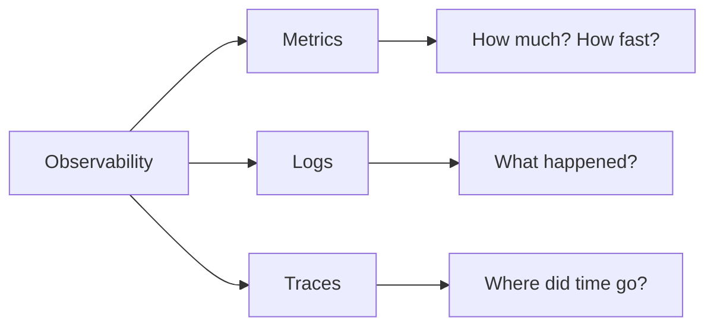

# 8. Observability Matters

**Rule:** If you can't see it in production, you can't fix it. Every meaningful operation deserves at least one of: a metric, a log, or a trace.

## Why this matters

A bug that takes 30 minutes to reproduce locally but 4 hours to find in production is an observability bug, not a code bug.

## The three pillars



| Pillar | Best for | Tools |
|---|---|---|
| **Metrics** | Aggregates over time — RPS, latency, error rate, queue depth | Prometheus, Datadog, CloudWatch |
| **Logs** | Structured events with context — "user X did Y with result Z" | Loki, Elasticsearch, Splunk |
| **Traces** | Following a single request across services | Jaeger, Tempo, Honeycomb |

## What to instrument (the minimum)

Every service should expose:

- **RED metrics** — Rate, Errors, Duration — per endpoint
- **USE metrics** — Utilization, Saturation, Errors — per resource (CPU, DB pool, queue)
- **Business metrics** — signups/min, orders/min, payment success rate

## Logging that actually helps

**Bad:**
```python
logger.info("processing")
```

**Good:**
```python
logger.info(
    "payment_processed",
    extra={
        "request_id": req.id,
        "user_id": user.id,
        "amount_cents": amount,
        "currency": currency,
        "gateway": "razorpay",
        "duration_ms": elapsed,
        "outcome": "success",
    }
)
```

Structured logs > free-text logs. Always. Every. Time.

:::tip The 3am test
At 3am during an incident, can you find — in under 60 seconds — the answer to: *"how many failed payments in the last 10 minutes, broken down by gateway?"* If yes, your observability is good.
:::

## Alerts that don't lie

- Alert on **symptoms** (user-facing impact) not **causes** (a single server CPU spike)
- Every alert must be actionable: include a runbook link
- If an alert fires more than once a week without a real incident, tune it or delete it
- Page only what wakes a human at 3am for a good reason
