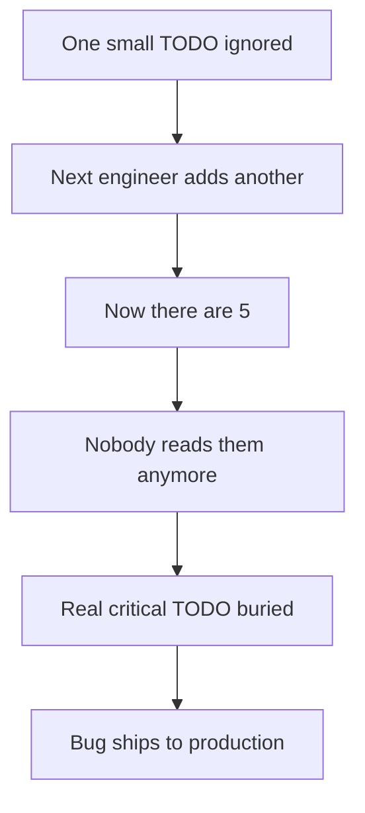

# 5. No Broken Windows

**Rule:** Fix the small mess before it becomes a big one. If you touch a file with a broken window — a typo, a dead branch, a misleading comment — fix it as you go.

## Why this matters

The "broken windows theory" of code says: visible decay invites more decay. If the codebase tolerates a `// TODO: remove this hack` from 2021, future engineers will leave their own hacks too.

## What counts as a broken window

- Commented-out code with no explanation
- `TODO`/`FIXME` with no owner or date
- Misleading variable names
- Type hints that lie
- Dead imports
- Stale comments referring to deleted code
- Lint warnings nobody addresses

## The "boy scout rule"

> Leave the campground cleaner than you found it.

When you touch a file for any reason:

1. Fix the typo in the docstring
2. Delete the dead branch
3. Rename the variable that confused you
4. Add the missing type hint

:::info Scope discipline
Cleanups should be **in the same PR if they touch lines you're already changing**, otherwise a separate `chore:` PR. Don't smuggle a 500-line refactor into a bugfix PR — see [Commandment #3](./three-small-pull-requests).
:::

## What QA can do

QA broken windows look different but matter just as much:

- Flaky tests that "everyone reruns" — quarantine or fix them, don't ignore
- Test data that's hand-curated and undocumented
- Bug reports without reproduction steps
- Test names like `test_thing_1`, `test_thing_2`
