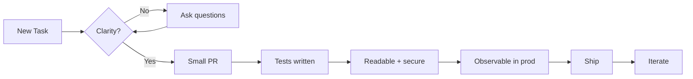

# The Ten Commandments of Engineering

These ten rules apply to **everyone** who touches code — backend, frontend, mobile, QA, SRE. They are not a style guide and they are not a process document. They are the cultural floor: violate them and the work suffers regardless of stack, team, or tool choice.

:::tip Read once, live by daily
Bookmark this page. Re-read it once a quarter. Discuss disagreements in your team retro — that is how a playbook stays alive.
:::

## The Ten

| # | Commandment | One-line gist |
|---|---|---|
| 1 | [Clarity Before Code](./one-clarity-before-code) | Understand the problem before opening the editor. |
| 2 | [Tests Are Not Optional](./two-tests-are-not-optional) | If it isn't tested, it isn't done. |
| 3 | [Small Pull Requests](./three-small-pull-requests) | A 200-line PR gets reviewed; a 2000-line PR gets rubber-stamped. |
| 4 | [Readability First](./four-readability-first) | Code is read 10× more than it is written. |
| 5 | [No Broken Windows](./five-no-broken-windows) | Fix the small mess before it becomes a big one. |
| 6 | [Handle Errors Explicitly](./six-handle-errors-explicitly) | Silent failures are the worst failures. |
| 7 | [Secure by Default](./seven-secure-by-default) | Security is a property of the design, not a checklist at the end. |
| 8 | [Observability Matters](./eight-observability-matters) | If you can't see it in production, you can't fix it. |
| 9 | [Document the Why](./nine-document-the-why) | Code shows *what*. Comments and ADRs must show *why*. |
| 10 | [Ship Then Improve](./ten-ship-then-improve) | Done is better than perfect — but "done" includes safety. |

## How to use this section

1. Read each commandment in order — they build on each other.
2. Take the [self-assessment quiz](./quiz) at the end to anchor what you learned.
3. When reviewing a PR or a test plan, reference the relevant commandment by number (e.g., *"this violates #3 — let's split it"*).

