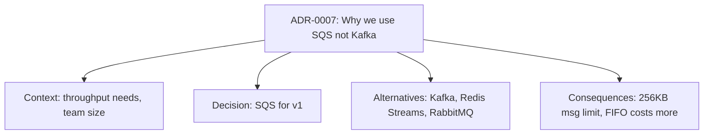

# 9. Document the Why

**Rule:** Code shows *what* it does. Comments, READMEs, and ADRs must show *why* it does it that way.

## Why this matters

A future engineer looking at your code can always answer "what does this line do?" by reading it. They cannot, however, recover *why* you made a non-obvious choice — that knowledge dies with the original author unless you write it down.

:::warning Comments that add nothing
```python
# increment counter by 1
counter += 1
```
This is noise. Delete it.
:::

## Comments that earn their keep

**Good comment:** explains a *non-obvious* constraint or decision.

```python
# We retry up to 3 times because Razorpay's settlement webhook
# occasionally fails the first delivery during peak hours (PG-2024-117).
# See: https://internal-docs/incidents/PG-2024-117
for attempt in range(3):
    ...
```

**Bad comment:** restates what the code already says.

```python
# Loop 3 times
for attempt in range(3):
    ...
```

## When to write each artifact

| Type | When to write |
|---|---|
| **Inline comment** | A non-obvious *why* — workaround, constraint, gotcha |
| **Function docstring** | Public API surface — params, returns, raises |
| **README** | Per-service: what it is, how to run it, who owns it |
| **ADR** (Architecture Decision Record) | Any decision with long-term consequences |
| **Runbook** | Every on-call scenario the team has seen at least once |

## What is an ADR?

A short, dated document capturing: *the context, the decision, the alternatives considered, the consequences*. ADRs live in git next to the code so they survive Confluence migrations.



See [API & Architecture → ADRs](../api/adr) for the template.

## The "newcomer" test

Could a new hire, joining your team on Monday, get a service running locally and understand the major design decisions by Friday — using only the docs in the repo?

If no, the docs aren't done.
