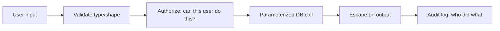

# 7. Secure by Default

**Rule:** Security is a property of the *design*, not a checklist applied at the end. Default to the safe choice; require an explicit decision to be unsafe.

## Why this matters

The cost of fixing a security flaw rises 10–100× from design → development → production. A SQL injection caught in code review costs minutes; the same flaw exploited in production costs careers.

## The Defaults

| Default to | Not |
|---|---|
| Parameterized queries | String concatenation |
| Allow-lists | Deny-lists |
| Server-side validation | Client-side only |
| HTTPS, HSTS | Plain HTTP |
| Short-lived tokens | Long-lived bearer tokens |
| Principle of least privilege | "Admin for now, we'll fix later" |
| Secrets in a vault | Secrets in env files in git |
| Logging *that* something happened | Logging *what* the secret was |

## The OWASP cheat sheet (memorize these)

1. **Injection** — SQL, command, LDAP. Always use parameterized APIs.
2. **Broken auth** — session fixation, JWT misuse, password storage.
3. **Sensitive data exposure** — PII, payment data, tokens in logs.
4. **XXE** — never parse XML with external entities enabled.
5. **Broken access control** — verify auth *server-side*, on every request.
6. **Security misconfiguration** — debug flags, default creds, stack traces in prod.
7. **XSS** — escape on output, use CSP.
8. **Insecure deserialization** — never deserialize untrusted input.
9. **Vulnerable dependencies** — run `npm audit`, `pip-audit`, dependabot.
10. **Insufficient logging** — you can't investigate what wasn't logged.



## Anti-patterns

```python
# CRITICAL: SQL injection
cursor.execute(f"SELECT * FROM users WHERE id = {user_id}")

# CRITICAL: secret in URL (logged everywhere)
requests.get(f"https://api.example.com/data?token={SECRET}")

# CRITICAL: client-side authorization
if request.headers.get('x-is-admin') == 'true':
    allow()
```

:::warning Threat model the feature
Before you ship anything that touches user input, auth, or sensitive data — ask: *"What could a malicious user do here?"* If you can't answer, get a security review.
:::

## What QA should do

- Add negative tests: malformed input, oversized input, wrong content types
- Test authorization: can user A read user B's data?
- Verify error responses don't leak stack traces
- Confirm secrets don't appear in logs
