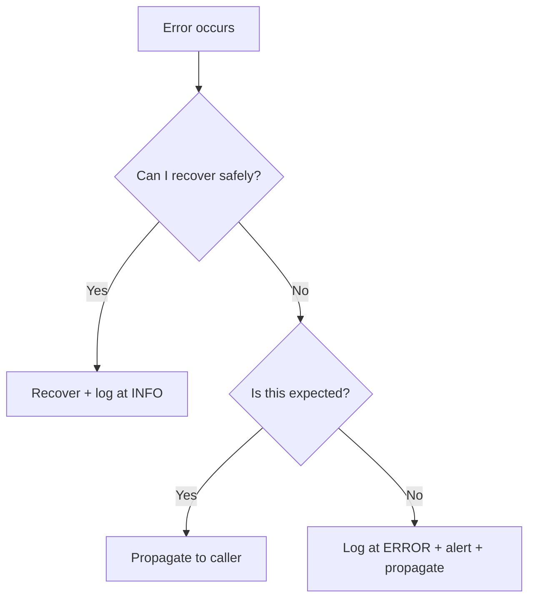

import Tabs from '@theme/Tabs';
import TabItem from '@theme/TabItem';

# 6. Handle Errors Explicitly

**Rule:** Silent failures are the worst failures. Every error path is a real path — name it, log it, decide what to do with it.

## Why this matters

Errors swallowed in production cause the longest, most demoralizing debugging sessions. A `try/except: pass` is a time bomb.

:::danger The cardinal sin
```python
try:
    do_thing()
except:
    pass
```
This is a crime scene. If you ever see it, **fix it** — that's a broken window ([Commandment #5](./five-no-broken-windows)).
:::

## The three honest options

When an error occurs, you have exactly three valid choices:

1. **Handle it** — recover and continue (e.g., retry with backoff)
2. **Propagate it** — let the caller decide (re-raise or return error)
3. **Fail loudly** — log, alert, and stop

What you may not do: **silently swallow**.

## Pattern: explicit error handling

<Tabs groupId="lang">
  <TabItem value="python" label="Python" default>

```python
def fetch_user(user_id: str) -> User:
    try:
        return db.users.get(user_id)
    except UserNotFound:
        raise  # caller's problem
    except DatabaseTimeout as e:
        logger.warning("DB timeout fetching user", user_id=user_id)
        raise ServiceUnavailable("user service temporarily unavailable") from e
    except Exception:
        logger.exception("unexpected error fetching user", user_id=user_id)
        raise  # never swallow
```

  </TabItem>
  <TabItem value="go" label="Go">

```go
func FetchUser(id string) (*User, error) {
    user, err := db.GetUser(id)
    if err != nil {
        if errors.Is(err, ErrNotFound) {
            return nil, err
        }
        log.Warn("db error fetching user", "id", id, "err", err)
        return nil, fmt.Errorf("fetch user %s: %w", id, err)
    }
    return user, nil
}
```

  </TabItem>
  <TabItem value="js" label="TypeScript">

```typescript
async function fetchUser(id: string): Promise<User> {
  try {
    return await db.users.get(id);
  } catch (err) {
    if (err instanceof UserNotFoundError) throw err;
    logger.error({err, id}, 'failed to fetch user');
    throw new ServiceUnavailableError('user service unavailable', {cause: err});
  }
}
```

  </TabItem>
</Tabs>

## Decision flow



## What QA should look for

- Error messages with no actionable info (e.g., `"Error"`)
- Stack traces missing from logs
- 500s that don't page anyone
- Retries with no backoff (causes thundering herd)
