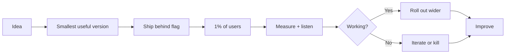

# 10. Ship Then Improve

**Rule:** Done is better than perfect — but "done" includes safety. Ship the smallest useful slice, learn, then improve.

## Why this matters

Perfection is the enemy of *learning*. Every day a feature sits in a branch unshipped is a day of zero feedback. Real users find real bugs you would never have predicted.

## "Done" includes:

- ✅ Works for the documented happy path
- ✅ Has tests ([#2](./two-tests-are-not-optional))
- ✅ Handles errors explicitly ([#6](./six-handle-errors-explicitly))
- ✅ Is observable in prod ([#8](./eight-observability-matters))
- ✅ Has a rollback plan
- ✅ Is behind a feature flag if risky

"Done" does **not** require:

- ❌ Every edge case nailed
- ❌ Perfect performance
- ❌ Beautiful code on every line
- ❌ Coverage of every theoretical user journey

## The MVP / MMP distinction

| Term | What it means |
|---|---|
| **MVP** (Minimum Viable Product) | Smallest thing that lets you *learn* whether the idea works |
| **MMP** (Minimum Marketable Product) | Smallest thing customers will actually pay for |
| **MLP** (Minimum Lovable Product) | The bar for *external launches* — has to actually be good |

Pick consciously. A B2B billing flow is not the place to ship an MVP.

## Feature flags are non-negotiable

For any change with user-visible behavior or risk:

1. Build behind a flag
2. Deploy with flag OFF
3. Enable for internal users
4. Enable for 1% → 10% → 50% → 100%
5. Monitor at each step

:::tip
A feature flag is also a rollback button. The fastest possible rollback is flipping a flag — no deploy needed.
:::

## When *not* to ship fast

- Migrations affecting > 1M rows
- Auth, payments, anything irreversible
- Changes that delete data
- Cross-region deploys without staging validation

Here, slow is fast. Measure twice, deploy once.
