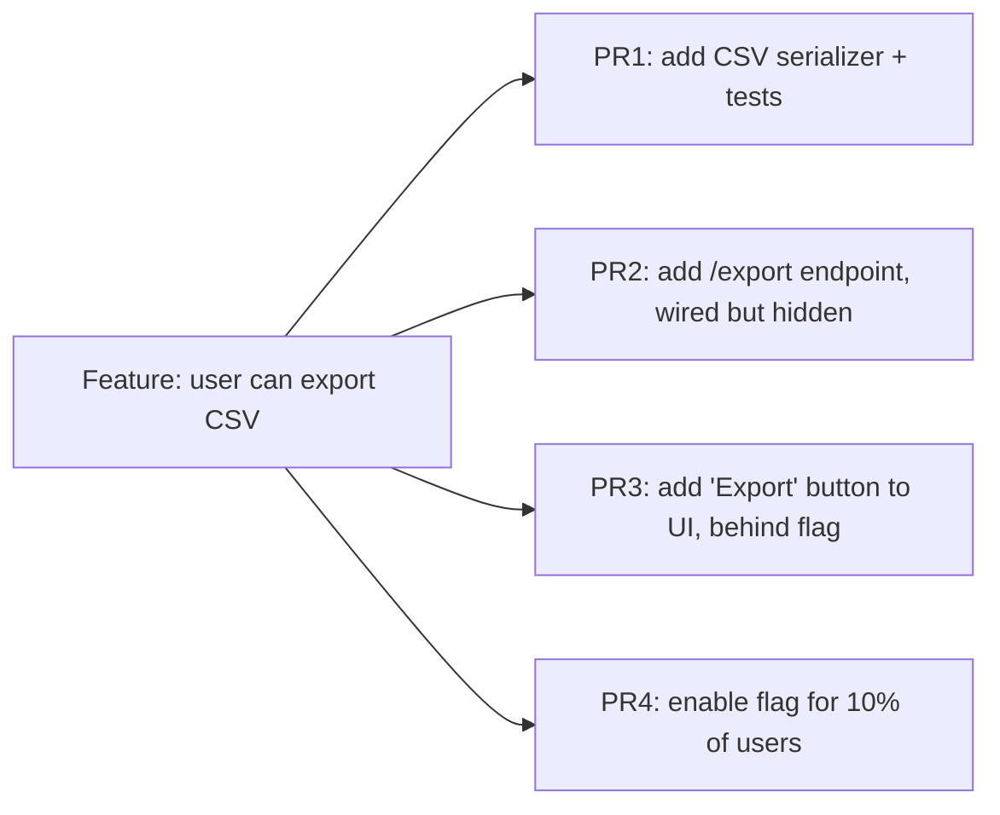

# 3. Small Pull Requests

**Rule:** Aim for PRs under 400 lines of diff. A 200-line PR gets *reviewed*; a 2000-line PR gets *rubber-stamped*.

## Why this matters

Review quality drops sharply with size. Past ~400 lines, reviewers default to LGTM-without-reading.

| PR size | Typical review depth |
|---|---|
| < 100 lines | Line-by-line scrutiny |
| 100–400 lines | Function-level review |
| 400–1000 lines | Skim + spot-check |
| > 1000 lines | "Looks fine 👍" |

## How to keep PRs small

1. **Plan before coding.** Break the work into orthogonal slices.
2. **Refactor in a separate PR.** Never mix "moved a function + added a feature."
3. **Land plumbing first.** New table, new endpoint stub, new flag — separately, behind a feature flag.
4. **Use stacked PRs** when one logical change is too big.

:::tip Heuristic
If your PR description starts with "this PR does X, Y, and Z" — split it into 3 PRs.
:::

## The split anatomy

Each PR is independently reviewable, revertible, and shippable.

## What goes in a good PR description

- **Why** — link to the ticket or problem
- **What** — bullet list of changes
- **How tested** — what you ran, what you observed
- **Risk** — what could break, what to roll back
- **Screenshots / GIFs** — for any UI change, always
