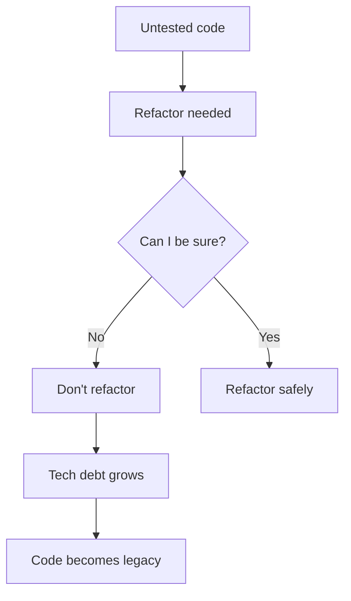

import Tabs from '@theme/Tabs';
import TabItem from '@theme/TabItem';

# 2. Tests Are Not Optional

**Rule:** If it isn't tested, it isn't done. Period. This applies equally to devs and QA — devs own unit/integration coverage, QA owns end-to-end and exploratory.

## Why this matters

Untested code is a liability you've handed to your future self. Every refactor, every dependency upgrade, every framework migration becomes a gamble.



## The minimum bar

- **Unit tests** for every public function with non-trivial logic
- **Integration tests** for every external boundary (DB, queue, API)
- **Smoke/E2E** for every user-visible critical path
- **No new code without at least one test**, unless it's a config-only change

## Example: same function, three test styles

<Tabs groupId="lang">
  <TabItem value="python" label="Python (pytest)" default>

```python
def discount(price: float, percent: int) -> float:
    if not 0 <= percent <= 100:
        raise ValueError("percent must be 0-100")
    return round(price * (1 - percent / 100), 2)

def test_discount_basic():
    assert discount(100, 20) == 80.0

def test_discount_rejects_invalid_percent():
    with pytest.raises(ValueError):
        discount(100, 150)
```

  </TabItem>
  <TabItem value="js" label="JavaScript (Jest)">

```javascript
function discount(price, percent) {
  if (percent < 0 || percent > 100) throw new Error('percent must be 0-100');
  return Math.round(price * (1 - percent / 100) * 100) / 100;
}

test('discount: basic case', () => {
  expect(discount(100, 20)).toBe(80);
});

test('discount: rejects invalid percent', () => {
  expect(() => discount(100, 150)).toThrow();
});
```

  </TabItem>
  <TabItem value="go" label="Go">

```go
func Discount(price float64, percent int) (float64, error) {
    if percent < 0 || percent > 100 {
        return 0, errors.New("percent must be 0-100")
    }
    return math.Round(price*(1-float64(percent)/100)*100) / 100, nil
}

func TestDiscount_Basic(t *testing.T) {
    got, _ := Discount(100, 20)
    if got != 80.0 {
        t.Errorf("got %v want 80.0", got)
    }
}
```

  </TabItem>
</Tabs>

:::info Coverage is a floor, not a ceiling
80% coverage with bad tests is worse than 60% coverage with great ones. Test behaviors, not lines.
:::

## Anti-patterns to spot in review

- "I'll add tests in a follow-up PR" → no, you won't
- Tests that mock the thing they're trying to verify
- Tests that pass even when the implementation is deleted
- Snapshot tests with no human-readable expectations
