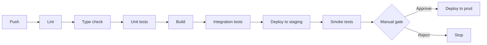

# CI / CD

A pipeline that's slow, flaky, or unclear is a tax on every PR. Treat the pipeline as a first-class product.

## The pipeline shape



## The 10-minute rule

The full PR pipeline should complete in **under 10 minutes**. Slower than that and engineers context-switch, lose flow, and start force-pushing without waiting for green.

### How to keep it fast

- Parallelize independent stages
- Cache dependencies aggressively (lockfile-keyed)
- Run only impacted tests on PR; full suite on merge to main
- Move expensive checks (E2E, perf) to nightly or staging

## Required gates (PR can't merge without)

| Gate | What it checks |
|---|---|
| Lint | Style + obvious bugs (eslint, ruff, golangci-lint) |
| Type check | Static type errors (mypy, tsc, gopls) |
| Unit tests | Logic correctness |
| Build | Code actually compiles / bundles |
| Security scan | Dependencies, secrets in commits |

## Deploy strategies

| Strategy | When |
|---|---|
| **Rolling** | Default for stateless services. Replaces pods one at a time. |
| **Blue/green** | When you need instant rollback. Two full environments, flip traffic. |
| **Canary** | Risky changes. Send 1% → 10% → 50% → 100%. Auto-rollback on error spike. |
| **Feature flag** | The fastest rollback of all — flip a config, no redeploy. |

## What "deployable" means

A change is deployable only if:

- ✅ All CI checks green
- ✅ At least one approving review
- ✅ Tested locally or in staging
- ✅ Has a rollback plan (revert PR, flag flip, or redeploy previous tag)

## Pipeline anti-patterns

:::warning Watch out for
- **Flaky tests left in main** — quarantine and fix, never ignore
- **`if: always()` on a deploy step** — deploys when tests fail
- **Secrets in pipeline logs** — mask in CI config, redact in app
- **Different test runners locally vs. CI** — green locally, red on CI = wasted hours
- **No staging environment** — production is your only test, this ends in tears
:::

## Sample GitHub Actions skeleton

```yaml
name: ci
on: [pull_request, push]
jobs:
  test:
    runs-on: ubuntu-latest
    steps:
      - uses: actions/checkout@v4
      - uses: actions/setup-node@v4
        with:
          node-version: '22'
          cache: 'npm'
      - run: npm ci
      - run: npm run lint
      - run: npm run typecheck
      - run: npm test -- --coverage
      - uses: codecov/codecov-action@v4
```
