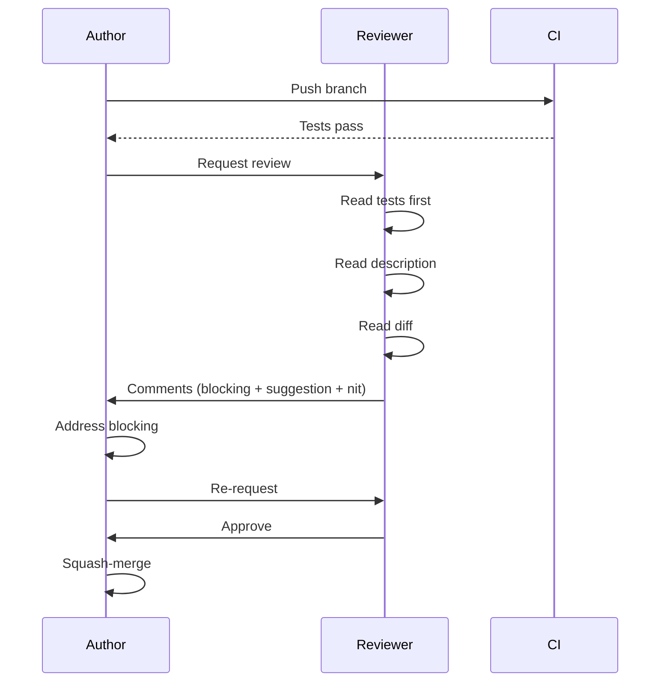

# Code Review

Code review is the **single highest-leverage activity** for code quality. It's also where teams quietly accumulate the most cultural debt.

## As the reviewer

### What to look for (in order of importance)

1. **Correctness** — does it do what it claims? Read the tests first; they document intent.
2. **Security** — see [Commandment #7](../commandments/seven-secure-by-default).
3. **Readability** — could a teammate maintain this in 6 months?
4. **Tests** — happy path + error paths + edge cases?
5. **Performance** — N+1 queries, missing indexes, blocking I/O?
6. **Observability** — can we debug this in prod?
7. **Style** — last. Style is for the linter, not the reviewer.

### What NOT to do

- ❌ Block on personal style preferences ("I'd write this differently")
- ❌ Demand refactors unrelated to the PR's purpose
- ❌ Leave only nit-level comments on a PR with structural problems
- ❌ "Looks fine 👍" on a 1500-line PR
- ❌ Sit on a PR for 3 days (target: < 4 business hours)

### Comment severity vocabulary

Prefix your comments so the author knows what blocks merge:

| Prefix | Meaning |
|---|---|
| **blocking:** | Must fix before merge |
| **suggestion:** | Recommend, but author decides |
| **nit:** | Tiny preference, fine to ignore |
| **question:** | Genuine ask, not a veiled criticism |
| **praise:** | Yes — call out good work too |

```
blocking: SQL injection — use parameterized query
suggestion: consider extracting this into a helper since it's used 3 times
nit: missing trailing newline
question: what happens if `user` is null here?
praise: love the test naming
```

## As the author

### Make your PR easy to review

1. **Small** ([Commandment #3](../commandments/three-small-pull-requests)) — under 400 lines diff
2. **Self-contained** — one logical change per PR
3. **Self-described** — write a description even your future self will thank you for
4. **Self-reviewed** — re-read your own diff before requesting review

### Good PR description template

```markdown
## Why
Link to ticket / issue. One paragraph on the problem.

## What
- Bullet 1
- Bullet 2

## How tested
- [ ] Unit tests added
- [ ] Manual test: <steps>
- [ ] Verified in staging

## Risk
What could break, what to watch in prod, rollback plan.

## Screenshots / GIFs
<for any UI change>
```

## The review loop



## Conflict resolution

When reviewer and author disagree:

1. Both state the principle they're optimizing for
2. If still stuck after one round, pull in a third opinion
3. The author makes the final call on style; the reviewer makes the final call on correctness/security
4. Move the conversation to a sync call if it exceeds 3 message round-trips
