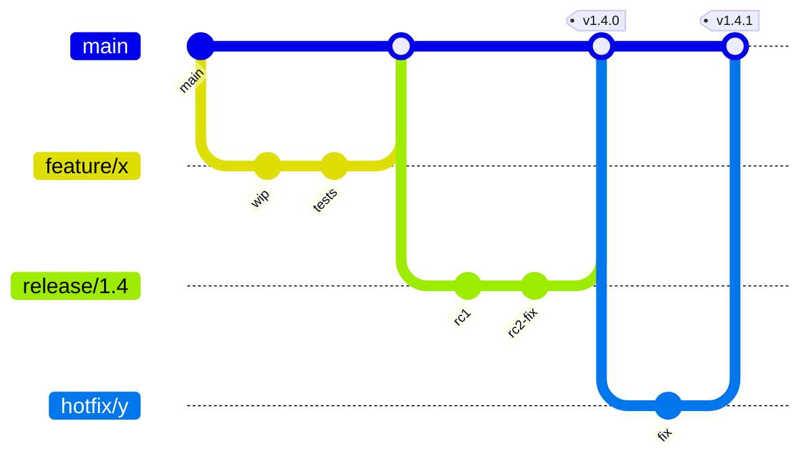

# Git Workflow

A pragmatic, trunk-based workflow that scales from solo projects to teams of 50+.

## Branching model



- **`main`** — always deployable; the source of truth
- **`feature/*`** — short-lived (1–3 days max), branched from `main`, merged via PR
- **`release/*`** — cut from `main` when a version needs stabilization (e.g., `release/1.4`). Only bug fixes and release-blocking changes go in; new features wait for the next release branch
- **`hotfix/*`** — branched from the latest release tag (or `main` if no release branch is in flight) for production fixes. Merged back into both `main` and any active `release/*` branch
- No long-running `develop` branch unless you have a release-train cadence

### When you need a `release/*` branch

Cut one when **any** of these is true:

- You ship on a fixed cadence (monthly, sprint-based) and need a stabilization window
- You support multiple versions in production simultaneously (e.g., on-prem customers on v1.3, SaaS on v1.4)
- A release needs QA sign-off, security review, or compliance gates before going live
- Mobile / native apps awaiting app-store review

If you continuously deploy from `main` and have a single live version, **skip release branches entirely** — they're overhead you don't need.

### Release branch rules

1. **Cut from `main` at a known-good commit**: `git checkout -b release/1.4 main`
2. **Tag the release** when shipped: `git tag v1.4.0 && git push --tags`
3. **Only bug fixes and release-blockers land on `release/*`** — features go to `main` for the next release
4. **Every fix on `release/*` is also merged back to `main`** (forward-port via cherry-pick or merge — never let `main` drift behind a release branch)
5. **Delete the branch when the version is EOL** — keep only the tag

## Commit message conventions

Use the **Conventional Commits** style — machine-parseable, human-readable.

```
feat: add CSV export to dashboard
fix(auth): handle expired JWT refresh tokens
chore: bump axios to 1.7.4
docs(api): document pagination params
test: add integration test for billing webhook
refactor: extract OrderValidator from OrderService
```

### Types

| Type | When |
|---|---|
| `feat` | New user-facing feature |
| `fix` | Bug fix |
| `refactor` | Internal restructure, no behavior change |
| `test` | Tests only |
| `docs` | Docs only |
| `chore` | Tooling, deps, configs |
| `perf` | Performance improvement |

## Rebase vs. merge

**Rebase** when:
- Cleaning up your local branch before opening a PR
- Pulling latest `main` into your feature branch

**Merge** when:
- Bringing a feature into `main` (use squash-merge or merge commit, never rebase-merge into main)

:::warning Never rebase shared branches
Rebasing rewrites history. If a teammate has based work on your branch, rebasing will break their state.
:::

## The standard flow

```bash
# 1. Sync with main
git checkout main
git pull --rebase

# 2. Branch
git checkout -b feature/csv-export

# 3. Work, commit often
git add .
git commit -m "feat: scaffold CSV serializer"

# 4. Before PR: rebase onto latest main
git fetch origin
git rebase origin/main

# 5. Push and open PR
git push -u origin feature/csv-export
gh pr create

# 6. After review feedback: amend or new commits, then push --force-with-lease
git commit --amend
git push --force-with-lease
```

## Release & hotfix flow

```bash
# --- Cutting a release branch ---
git checkout main
git pull --rebase
git checkout -b release/1.4
git push -u origin release/1.4

# --- Bug fix on the release branch ---
git checkout release/1.4
git checkout -b fix/checkout-rounding
# ... commit fix ...
gh pr create --base release/1.4

# --- Tag and ship ---
git checkout release/1.4
git tag v1.4.0
git push --tags

# --- Forward-port fix into main ---
git checkout main
git pull --rebase
git cherry-pick <fix-sha-from-release-branch>
git push

# --- Hotfix on production (release branch active) ---
git checkout release/1.4
git pull --rebase
git checkout -b hotfix/oauth-callback
# ... commit fix ...
gh pr create --base release/1.4   # ships to prod
# Then cherry-pick into main (and any newer active release branches)
```

:::warning Never let `main` drift behind a release branch
Every fix that lands on `release/*` MUST be forward-ported to `main` (and any newer active release). If `main` is missing a fix the release has, you'll re-ship that bug in the next release.
:::

## When things go wrong

| Situation | Fix |
|---|---|
| Committed to wrong branch | `git reset --soft HEAD~1`, switch branch, recommit |
| Need to undo last commit but keep changes | `git reset --soft HEAD~1` |
| Need to undo last commit and discard changes | `git reset --hard HEAD~1` (⚠ destructive) |
| Accidentally pushed a secret | Rotate the secret, then `git filter-repo` (or contact security) |
| Merge conflict during rebase | Resolve, `git add`, `git rebase --continue` |

:::tip Force-push safely
Always use `--force-with-lease` instead of `--force`. It refuses to overwrite if someone else pushed to your branch in the meantime.
:::
