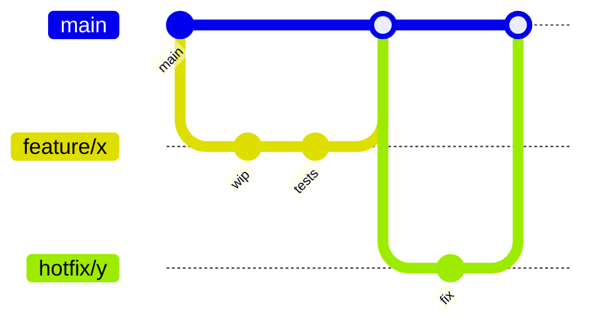

# Git Workflow

A pragmatic, trunk-based workflow that scales from solo projects to teams of 50+.

## Branching model



- **`main`** — always deployable
- **`feature/*`** — short-lived (1–3 days max)
- **`hotfix/*`** — direct from `main`, merged back fast
- No long-running `develop` branch unless you have a release-train cadence

## Commit message conventions

Use the **Conventional Commits** style — machine-parseable, human-readable.

```
feat: add CSV export to dashboard
fix(auth): handle expired JWT refresh tokens
chore: bump axios to 1.7.4
docs(api): document pagination params
test: add integration test for billing webhook
refactor: extract OrderValidator from OrderService
```

### Types

| Type | When |
|---|---|
| `feat` | New user-facing feature |
| `fix` | Bug fix |
| `refactor` | Internal restructure, no behavior change |
| `test` | Tests only |
| `docs` | Docs only |
| `chore` | Tooling, deps, configs |
| `perf` | Performance improvement |

## Rebase vs. merge

**Rebase** when:
- Cleaning up your local branch before opening a PR
- Pulling latest `main` into your feature branch

**Merge** when:
- Bringing a feature into `main` (use squash-merge or merge commit, never rebase-merge into main)

:::warning Never rebase shared branches
Rebasing rewrites history. If a teammate has based work on your branch, rebasing will break their state.
:::

## The standard flow

```bash
# 1. Sync with main
git checkout main
git pull --rebase

# 2. Branch
git checkout -b feature/csv-export

# 3. Work, commit often
git add .
git commit -m "feat: scaffold CSV serializer"

# 4. Before PR: rebase onto latest main
git fetch origin
git rebase origin/main

# 5. Push and open PR
git push -u origin feature/csv-export
gh pr create

# 6. After review feedback: amend or new commits, then push --force-with-lease
git commit --amend
git push --force-with-lease
```

## When things go wrong

| Situation | Fix |
|---|---|
| Committed to wrong branch | `git reset --soft HEAD~1`, switch branch, recommit |
| Need to undo last commit but keep changes | `git reset --soft HEAD~1` |
| Need to undo last commit and discard changes | `git reset --hard HEAD~1` (⚠ destructive) |
| Accidentally pushed a secret | Rotate the secret, then `git filter-repo` (or contact security) |
| Merge conflict during rebase | Resolve, `git add`, `git rebase --continue` |

:::tip Force-push safely
Always use `--force-with-lease` instead of `--force`. It refuses to overwrite if someone else pushed to your branch in the meantime.
:::
