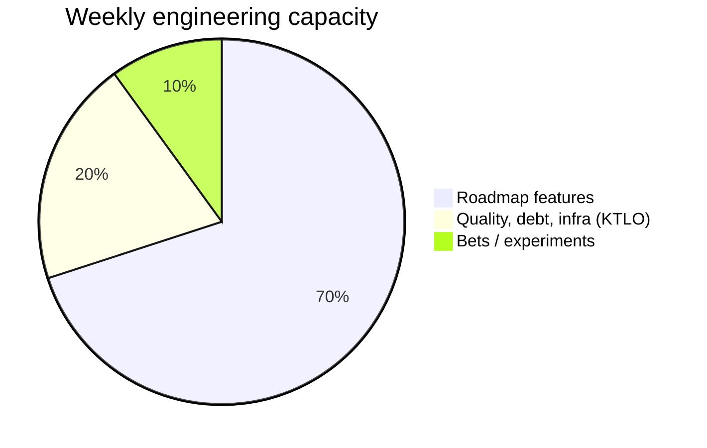
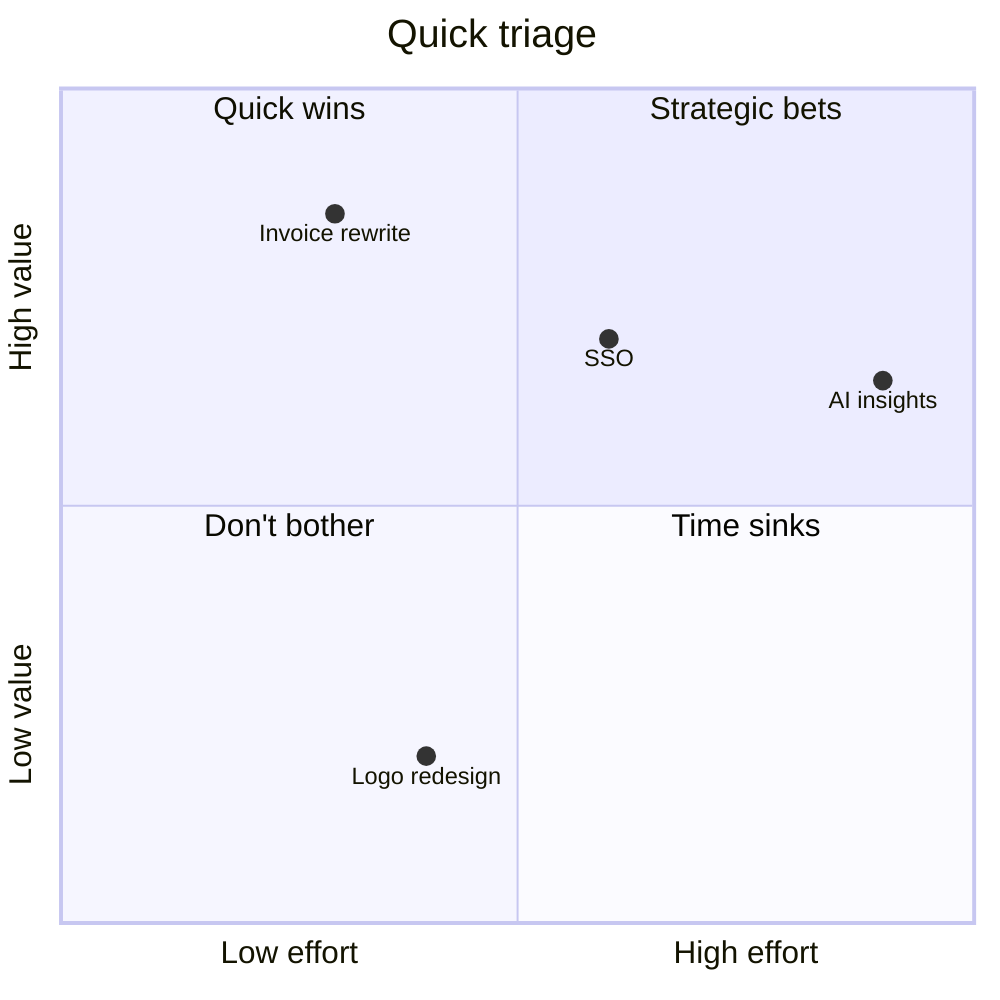

# Prioritisation

Engineering capacity is finite. Demand is infinite. The work that gets done depends on which framework you use to decide, and how honestly you apply it.

## The core problem

> If everything is P1, nothing is P1.

Symptoms that your team has no real prioritisation model:

- Stakeholders pitch directly to engineers; loudest voice wins
- Every sprint slips because mid-sprint requests get accepted
- Tech debt grows because it's never anyone's *biggest* priority
- The same bug type keeps appearing because root-cause work loses to feature work
- Engineers context-switch 5+ times a day

A prioritisation model isn't bureaucracy — it's the contract that protects the team from chaos.

## Capacity allocation (do this first)

Before you score any individual item, decide **what kind of work** gets what slice of the team's time.

A defensible default for most engineering teams:



| Bucket | What it covers | Why it gets a fixed slice |
|---|---|---|
| **Roadmap (70%)** | Planned features, customer commitments | The business case for the team's existence |
| **KTLO (20%)** | Tech debt, infra, security patches, flaky-test fixes, on-call follow-ups | Without this, velocity decays — silently at first, then catastrophically |
| **Bets (10%)** | Prototypes, exploration, refactors that *might* pay off | The team's option-value account |

Adjust the numbers — a brand-new product might be 90/5/5; a stable mature platform might be 50/40/10. **The point is to fix the ratio, not the values.** Then prioritise *within* each bucket.

:::warning Don't blend buckets
"This refactor is a feature" is how KTLO budgets get raided to zero. Tag work by bucket; track the split monthly. If KTLO drops below the floor for two months running, something is wrong.
:::

## Frameworks for ranking *within* a bucket

### 1. RICE — for roadmap features

**R**each × **I**mpact × **C**onfidence ÷ **E**ffort

| Factor | Scale | Meaning |
|---|---|---|
| Reach | # users / period | "How many people does this touch per quarter?" |
| Impact | 0.25 / 0.5 / 1 / 2 / 3 | Minimal / Low / Medium / High / Massive |
| Confidence | 50% / 80% / 100% | How sure are we about the above numbers? |
| Effort | Person-weeks | How long will it actually take? |

```
RICE score = (Reach × Impact × Confidence) / Effort
```

Highest score wins. Useful because **Confidence** kills hand-wavy "this will be huge" pitches — you can't claim 3× impact at 50% confidence and still beat a smaller, sure-thing item.

**Example:**

| Item | Reach | Impact | Confidence | Effort | Score |
|---|---|---|---|---|---|
| Add SSO for enterprise | 500 | 2 | 80% | 4 weeks | 200 |
| Rewrite invoice PDF generator | 5000 | 1 | 100% | 2 weeks | 2500 |
| AI-powered insights | 10000 | 3 | 30% | 12 weeks | 750 |

The boring rewrite wins. RICE forces you to confront that.

### 2. Eisenhower Matrix — for interrupts

When a request lands mid-sprint, place it:

```
              URGENT          NOT URGENT
            ┌──────────────┬──────────────┐
IMPORTANT   │ DO NOW       │ SCHEDULE     │
            │ (incident,   │ (planned     │
            │  outage)     │  roadmap)    │
            ├──────────────┼──────────────┤
NOT         │ DELEGATE     │ DROP         │
IMPORTANT   │ (someone     │ (politely    │
            │  else's job) │  decline)    │
            └──────────────┴──────────────┘
```

The trap: most "urgent" requests are not actually urgent. Ask the requester *"what breaks if we do this next sprint instead?"* — the answer usually moves the item to "schedule."

### 3. Cost of Delay / WSJF — for sequencing bets

Two items might both be valuable. The question is: **which one loses more by waiting?**

```
WSJF = Cost of Delay / Job Size
```

Cost of Delay = value/week + risk-reduction value + opportunity-enablement value.

Use WSJF when items are roughly the same value but very different in size. The smaller item with similar payoff almost always wins.

### 4. Value vs. Effort 2×2 — for quick visual triage

When you have a long list and want to filter fast:



- **Quick wins** (top-left) → do these *this sprint*
- **Strategic bets** (top-right) → schedule with a clear hypothesis and a kill date
- **Time sinks** (bottom-right) → almost always a "no"
- **Don't bother** (bottom-left) → archive

This is **not** a substitute for RICE — it's a 60-second filter before you do the careful scoring.

## Bug & incident prioritisation

Bugs need their own scale because they don't compete with features on the same axes.

| Severity | Definition | SLA |
|---|---|---|
| **P0** | Production down, data loss, security breach | All hands, < 1h response |
| **P1** | Major feature broken, no workaround, affects many | Fix in current sprint |
| **P2** | Feature broken with workaround OR small user subset affected | Fix within 2 sprints |
| **P3** | Minor / cosmetic | Backlog, fix opportunistically |

:::tip Defaulting is forbidden
Every bug gets a severity assigned at intake. "Unset" is not an option. Default-to-P1 is also forbidden — that's how the bucket loses meaning.
:::

## Saying no — the hardest engineering skill

A good prioritisation model gives you the **language** to decline:

| Instead of | Say |
|---|---|
| "We don't have time" | "This is below the line on our roadmap. Here's what would have to drop to make room." |
| "That's not a P1" | "By our severity matrix this is P3 — the SLA is 'fix opportunistically.' What's the user impact we're missing?" |
| "We hate that idea" | "This scored 80 on RICE, lowest in the batch. The top scorers are X, Y, Z." |
| "Maybe next quarter" | "Add it to the inbound queue. We'll re-score at quarterly planning." |

The pattern: anchor on the *system*, not on personal judgement. People argue with opinions; they don't argue with their own data.

## The prioritisation meeting

Run it monthly. 90 minutes max. Output: a prioritised list everyone has seen.

| Stage | Time | Owner |
|---|---|---|
| Review last cycle: shipped vs. planned, KTLO ratio actuals | 15 min | EM |
| New requests since last meeting | 20 min | PM |
| Score new items (RICE / WSJF as appropriate) | 30 min | Team |
| Re-rank top 20 | 15 min | Team |
| Confirm bucket allocation (70/20/10 or whatever) | 10 min | EM + PM |

Publish the output. Stakeholders can see *exactly* why their thing is or isn't getting done.

## Common anti-patterns

:::danger Watch out for
- **HiPPO** (Highest-Paid Person's Opinion) — the founder/VP's whim trumps the score. Defuse by including them in scoring, not by overriding scoring.
- **Resume-driven development** — work picked because it's interesting, not impactful. Score it like everything else.
- **Sunk-cost continuation** — "we're 3 months in, we have to finish" — re-score *current* projects monthly, kill the ones that no longer pencil out.
- **Estimation theater** — Effort numbers everyone knows are wrong. Use t-shirt sizes (XS/S/M/L/XL) before fake-precise week counts.
- **KTLO bankruptcy** — quarter after quarter, KTLO loses to "just this one feature." Set a floor and protect it.
:::

## The 80% rule

You will never have perfect information. A prioritisation framework that gets you to the *top decisions* with 80% confidence in an hour beats a framework that gets you to 95% confidence in a week.

Pick a model. Use it imperfectly. Improve it quarterly. **Consistency beats sophistication.**
