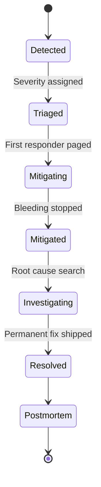

# Incident Response

When production is on fire, you don't want creativity — you want a checklist.

## The on-call mindset

1. **Stop the bleeding first.** Understand later.
2. **Communicate early, often, briefly.** Stakeholders panic without updates.
3. **Don't fly solo.** Page a partner if the scope is unclear.
4. **Document while it's happening** — your future postmortem self will thank you.

## The incident lifecycle



## Severity definitions

| Sev | Definition | Response time | Comms |
|---|---|---|---|
| **Sev 1** | All users impacted, no workaround | Page immediately, all hands | Status page + customers + execs |
| **Sev 2** | Major feature broken or large subset of users | < 15 min | Status page + customers |
| **Sev 3** | Minor feature broken, workarounds exist | < 1h | Internal Slack |
| **Sev 4** | Cosmetic / non-blocking | Next business day | Ticket |

## Mitigation playbook (try in order)

1. **Roll back the last deploy.** If something broke right after a deploy, this is your answer 80% of the time.
2. **Flip the feature flag off.** Faster than a rollback if the change is flag-gated.
3. **Scale up.** If it's saturation, more replicas / bigger DB / more workers.
4. **Drain traffic.** Move users to another region / disable a noisy endpoint.
5. **Restart the unhappy thing.** Not glamorous, often works for memory leaks.

## Comms template (Sev 1/2)

Post to status channel every 15 min during active incident:

```
[INCIDENT — INV-2026-014] Update 10:42 IST

Impact: ~30% of checkout requests failing with 500.
Started: 10:14 IST after deploy of api@v1.2.4.
Current status: Rolling back to v1.2.3. ETA 10:50.
Next update: 10:55 or sooner.

IC: @sushant
Comms: @kajal
```

Keep it tight. Stakeholders want: *what's broken, what we're doing, when we'll update next*.

## After the fire: the postmortem

Within 5 business days of resolution:

| Section | Contents |
|---|---|
| **Summary** | One paragraph — what happened, impact, resolution |
| **Timeline** | UTC timestamps from detection → resolution |
| **Impact** | Users affected, duration, revenue/SLA impact |
| **Root cause** | The technical why, with evidence |
| **Contributing factors** | What made it worse / slower to detect |
| **What went well** | Mitigation worked? Tooling helped? |
| **Action items** | Owned, dated, prioritized — see below |

## Blameless culture

The postmortem is about **systems**, not **people**. The phrasing matters:

| ❌ Blameful | ✅ Blameless |
|---|---|
| "Sushant deployed without testing" | "Our deploy pipeline didn't block on the failing smoke test" |
| "QA missed this" | "No automated test covered this scenario; we'll add one" |

## Action items that actually happen

| Anti-pattern | What to do instead |
|---|---|
| "We should be more careful" | Add a CI check that fails when X |
| "We'll write a runbook" | Write it now, link it in the doc |
| Unassigned action items | Every AI has an owner and a due date |
| Action items with no due date | Add date or move to a backlog with priority |

Track AIs in a tracker, not in the postmortem doc. Review at next incident review meeting.
