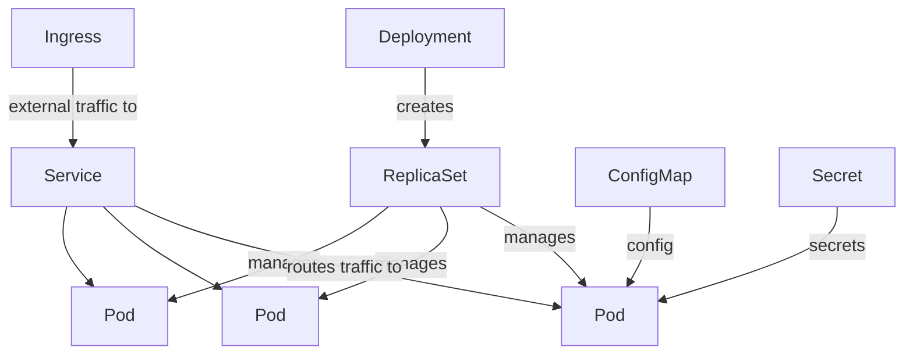

# Kubernetes

K8s has a steep cliff, but ~20% of its surface area handles ~80% of typical production needs. This is that 20%.

## The mental model



| Object | One-line role |
|---|---|
| **Pod** | One or more containers sharing network/storage. Smallest deployable unit. |
| **Deployment** | Declarative replica management — "run 3 pods, keep this image" |
| **Service** | Stable network endpoint for a set of pods |
| **Ingress** | HTTP(S) routing from outside the cluster |
| **ConfigMap** | Non-secret key/value config |
| **Secret** | Secret key/value (base64-encoded — use a real secret manager for sensitive data) |
| **HPA** | Horizontal Pod Autoscaler — scales replicas on CPU/custom metrics |
| **PDB** | PodDisruptionBudget — "always keep at least N pods up during voluntary disruptions" |

## A production-shaped Deployment

```yaml
apiVersion: apps/v1
kind: Deployment
metadata:
  name: api
  labels: {app: api}
spec:
  replicas: 3
  strategy:
    type: RollingUpdate
    rollingUpdate: {maxSurge: 1, maxUnavailable: 0}
  selector:
    matchLabels: {app: api}
  template:
    metadata:
      labels: {app: api}
    spec:
      containers:
        - name: api
          image: ghcr.io/org/api:v1.2.3   # pin to a tag, never :latest
          ports: [{containerPort: 3000}]
          resources:
            requests: {cpu: "100m", memory: "256Mi"}
            limits:   {cpu: "500m", memory: "512Mi"}
          readinessProbe:
            httpGet: {path: /health, port: 3000}
            initialDelaySeconds: 5
            periodSeconds: 5
          livenessProbe:
            httpGet: {path: /health, port: 3000}
            initialDelaySeconds: 15
            periodSeconds: 15
          env:
            - name: DB_HOST
              valueFrom: {configMapKeyRef: {name: api-config, key: db.host}}
            - name: DB_PASSWORD
              valueFrom: {secretKeyRef: {name: api-secrets, key: db.password}}
```

## The five non-negotiables

1. **Resource requests + limits** — without these, the scheduler guesses and pods get OOM-killed at 3am
2. **Readiness + liveness probes** — without these, traffic hits a not-ready pod
3. **PDB for any replica > 1** — node drains will take you down otherwise
4. **Image tag pinned, not `:latest`** — repeatable deploys
5. **Non-root securityContext** — `runAsNonRoot: true, runAsUser: 1000`

## Common gotchas

| Symptom | Often caused by |
|---|---|
| Pod restarts every few minutes | Liveness probe too strict, OOM kill (`kubectl describe pod`) |
| Service routes to nothing | Selector labels don't match pod labels |
| Deploy "hangs" | Readiness probe never goes green |
| 502 / 503 during rolling deploy | Missing `preStop` hook + `terminationGracePeriodSeconds` |
| Pod can reach internet but not other services | NetworkPolicy or DNS misconfig |

## Useful debugging commands

```bash
kubectl get pods -n <ns>
kubectl describe pod <pod> -n <ns>
kubectl logs <pod> -n <ns> --tail 200 --follow
kubectl logs <pod> -n <ns> --previous           # crashed pod's last logs
kubectl exec -it <pod> -n <ns> -- /bin/sh
kubectl top pod -n <ns>                          # actual resource use
kubectl get events -n <ns> --sort-by='.lastTimestamp'
```

:::tip Read events first
`kubectl get events` is the fastest way to understand why something is unhappy. Try it before logs.
:::
