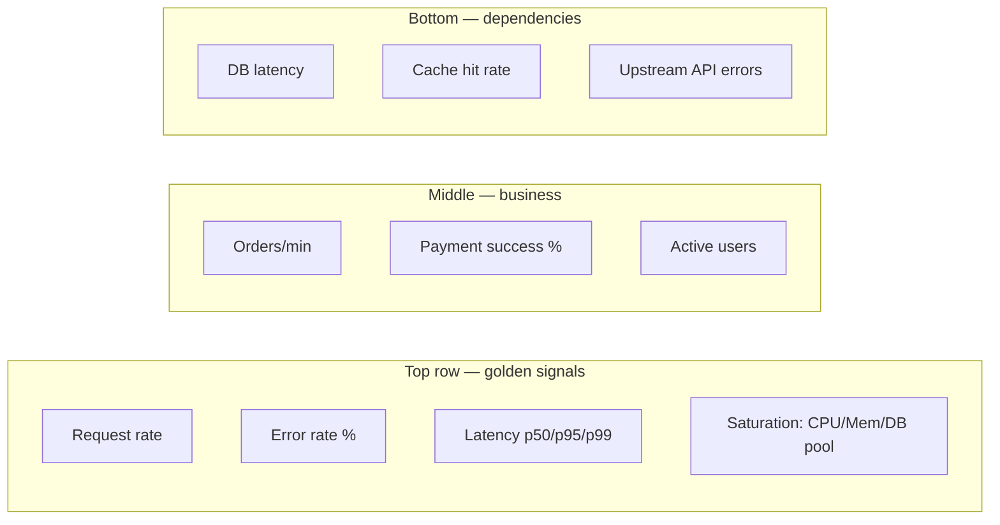

# Observability

What [Commandment #8](../commandments/eight-observability-matters) says at a principle level, this guide makes concrete: *what to actually instrument, and how*.

## The instrumentation checklist

For every service, before it goes to production:

- [ ] **`/health`** endpoint (200 if alive)
- [ ] **`/ready`** endpoint (200 only if DB + dependencies reachable)
- [ ] **`/metrics`** endpoint (Prometheus format)
- [ ] **Structured logs** to stdout (JSON), captured by the log shipper
- [ ] **Trace context propagation** via `traceparent` header
- [ ] **Per-endpoint RED metrics** — Rate, Errors, Duration
- [ ] **Business event logs** — payments, signups, orders

## The signals to alert on

Symptoms over causes:

| Symptom (alert on) | Cause (investigate via dashboards) |
|---|---|
| Error rate > 1% for 5 min | A bug, a bad deploy, a downstream outage |
| p95 latency > 1s for 5 min | DB slow query, cold cache, bad index |
| 5xx spike on `/checkout` | Payment gateway, DB connection pool, OOM |
| Queue depth > 10k for 10 min | Consumers slow / dead |
| Disk > 80% | Log rotation broken, runaway writes |

## A useful dashboard

Every service should have a dashboard with:



## Logging schema

Pick one schema and use it everywhere:

```json
{
  "timestamp": "2026-06-23T10:14:22.451Z",
  "level": "INFO",
  "service": "billing-api",
  "version": "v1.2.3",
  "environment": "production",
  "request_id": "req_abc123",
  "trace_id": "5b8aa5a2d2c872e8321cf37308d69df2",
  "user_id": "u_42",
  "event": "payment_processed",
  "duration_ms": 142,
  "amount_cents": 1500,
  "currency": "INR",
  "gateway": "razorpay",
  "outcome": "success"
}
```

Every log has: `timestamp`, `level`, `service`, `request_id`, `event`.

## Tracing — when you need it

Distributed traces are essential when:

- More than 2 services are in a request path
- You're chasing tail latency (the 99th percentile)
- You're debugging "it's slow but I don't know which hop"

Use OpenTelemetry — vendor-neutral, supported by Jaeger, Tempo, Honeycomb, Datadog, etc.

## Cost-aware observability

Observability data grows fast. Apply sampling:

| Signal | Strategy |
|---|---|
| Errors / slow requests | 100% — never sample these |
| Healthy traces | 1–10% sampling fine |
| Debug logs | Off in prod, on per-request via header |
| Metrics | Keep all — they're cheap |
:::warning Don't log secrets
PAN, CVV, passwords, tokens, OTPs. Add a redaction layer in the logger; never trust the developer to remember.
:::
