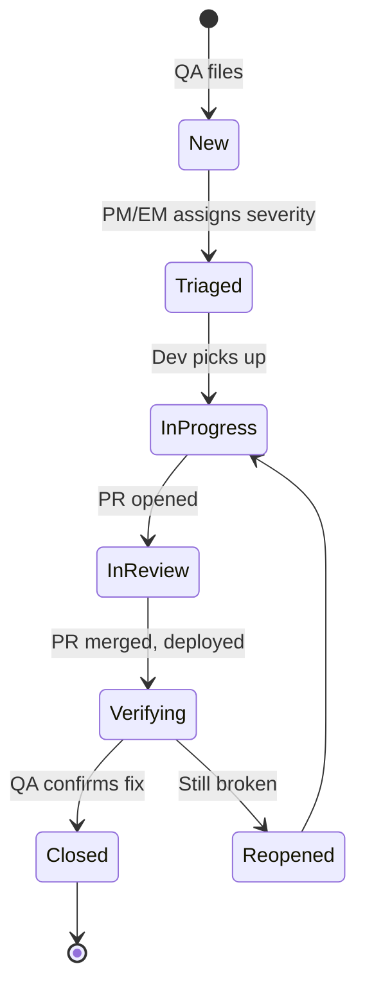

# Bug Reporting

A great bug report gets fixed in hours. A bad one bounces between QA and dev for days. The difference is information density.

## The anatomy

Every bug report should contain:

| Section | What goes here |
|---|---|
| **Title** | One sentence: "Symptom + context" |
| **Environment** | Browser, OS, app version, user role |
| **Steps to reproduce** | Numbered, minimal, deterministic |
| **Expected** | What should happen |
| **Actual** | What actually happens |
| **Frequency** | Always / Sometimes / Once |
| **Severity** | Blocker / Critical / Major / Minor / Trivial |
| **Evidence** | Screenshots, video, logs, network HAR |
| **First seen** | Build / commit if known |

## Title formula

> `[Component] Symptom when [condition]`

✅ `[Checkout] "Pay" button disabled when card expiry is 12/30`
❌ `Pay button broken`
❌ `Checkout doesn't work`

## Steps to reproduce — the gold standard

Numbered, executable, no ambiguity:

```
1. Log in as user QA-001 (password in 1Password "QA Test Users")
2. Navigate to /products/SKU-123
3. Click "Add to cart"
4. Click cart icon (top right)
5. Click "Proceed to checkout"
6. Fill card: 4242 4242 4242 4242, expiry 12/30, CVV 123
7. Click "Pay"

Expected: "Order confirmed" page within 5s
Actual: "Pay" button becomes greyed out, no response. Network shows POST /api/orders returns 500
```

Anyone — dev, PM, support, you in 3 months — can re-execute this.

## Severity vs. priority

These are different axes — don't conflate them.

| | **Severity** (technical impact) | **Priority** (business urgency) |
|---|---|---|
| Set by | QA / engineering | PM / owner |
| Answers | "How bad is the failure?" | "When do we fix it?" |

A typo on the marketing page = low severity, possibly high priority. A crash in an unused admin tool = high severity, possibly low priority.

## Evidence checklist

- 📸 **Screenshot** of the broken state, with relevant UI context
- 🎥 **Video** for any timing/animation/interaction issue
- 📋 **Console logs** copied as text (not screenshot)
- 🌐 **Network HAR** for any API failure
- 🆔 **Request ID / trace ID** — links the report to backend logs
- 📅 **Timestamp** in UTC for log correlation

## The "fix in one read" test

A good bug report lets the developer reproduce on the first read, without follow-up questions. If a dev pings you with *"how do I reproduce this?"* — the report wasn't done.

## Workflow



:::tip Close with proof
"Verified on staging, build #4521, steps re-run, all green." Not "looks fixed."
:::
