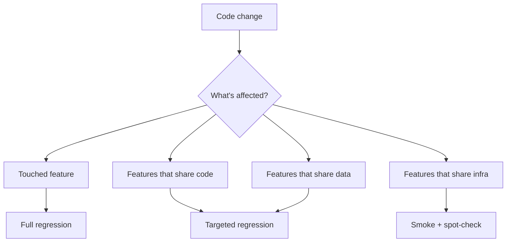

# Regression Prevention

A regression is a bug that was fixed once and came back. Every regression is a process failure, not just a code failure.

## The non-negotiable rule

> **Every fixed bug gets an automated test before it can be closed.**

That test:
- Reproduces the bug in the *before* state
- Passes in the *after* state
- Lives in the suite forever as a tripwire

This single rule, applied consistently, prevents 80%+ of regressions.

## Regression suite hygiene

Regression suites tend to grow unbounded. Periodically prune:

| Symptom | Action |
|---|---|
| Test passes for 18 months without ever catching anything | Keep — it's working |
| Test covers a feature that was removed | Delete |
| Test is flaky and gets skipped | Fix or delete |
| Test duplicates another | Merge |
| Test runs in 8 minutes | Move to nightly, not PR |

## Risk areas — always test on every release

These deserve standing automated coverage, refreshed every sprint:

1. **Auth flows** — login, logout, password reset, OAuth
2. **Payments** — every gateway, every method, every currency
3. **Permissions / authorization** — can A see B's data?
4. **Data migrations** — old data still reads correctly
5. **Critical reports** — financial summaries, exports
6. **Integrations** — every webhook, every cron, every queue consumer

## The change matrix

When something is being changed, what should be re-tested?

## Pre-release checklist

Before every release, QA runs through:

- [ ] Auth: login (3 methods), logout, session timeout
- [ ] Payments: each gateway, each method, refund flow
- [ ] Permissions: user-role matrix spot-checks
- [ ] Mobile / responsive sanity
- [ ] Browser matrix (Chrome, Safari, Firefox, latest 2 versions)
- [ ] Performance: home page < 2s, key API < 500ms p95
- [ ] Error states render gracefully (offline, 500, 403)
- [ ] Telemetry: key events still firing

## The 5-Why post-regression

When a regression escapes to prod, run a quick 5-Why:

1. Why did the bug occur?
2. Why didn't the test catch it?
3. Why wasn't a test added when it was first fixed?
4. Why didn't review/CI catch it?
5. What process change prevents the next one?

Write this up. Share it. The point is *learning*, not blame.
