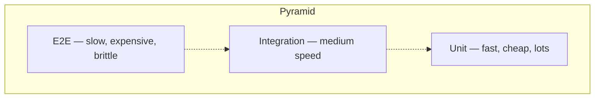

# Test Strategy

A clear test strategy answers: *what do we test, at which layer, and why?*

## The test pyramid

| Layer | Volume | Speed | What to test |
|---|---|---|---|
| **Unit** | Thousands | < 1s total | Pure logic, single functions, edge cases |
| **Integration** | Hundreds | Seconds | Boundaries — DB, queue, HTTP client |
| **E2E** | Dozens | Minutes | Critical user journeys end-to-end |
| **Exploratory** | Continuous | Human-paced | What automated tests can't predict |

:::warning Inverted pyramid is a smell
If your suite is mostly E2E with few units, you have a slow, flaky, expensive test ladder. Push tests down.
:::

## What to automate

**Automate:**
- Repetitive regression checks
- Critical paths (signup, login, checkout, payment)
- Calculations / business rules
- API contracts

**Don't automate:**
- Things changing weekly (UI polish, copy)
- Aesthetic checks (visual regression is a separate discipline)
- One-off explorations
- Things only a human can judge ("does this feel right?")

## Risk-based prioritization

Not all features deserve equal coverage. Score them:

| Factor | Low | Medium | High |
|---|---|---|---|
| **Blast radius** if broken | Single user | Tenant | All users |
| **Frequency** of use | Monthly | Weekly | Every session |
| **Reversibility** | Trivial undo | Manual fix | Data loss |

High blast × high frequency × low reversibility = test it like your career depends on it. **Payment flows. Auth flows. Data deletion.**

## The "what could go wrong" checklist

For every feature, write down:

1. **Boundary values** — empty, max, negative, very large
2. **Concurrency** — two users do this at once
3. **Failure modes** — DB down, queue full, partial network
4. **Edge data** — Unicode, emoji, RTL languages, long strings
5. **Authorization** — can user A access user B's data?
6. **Idempotency** — what happens if the request is retried?

This list, written before automation, is more valuable than the automation itself.
